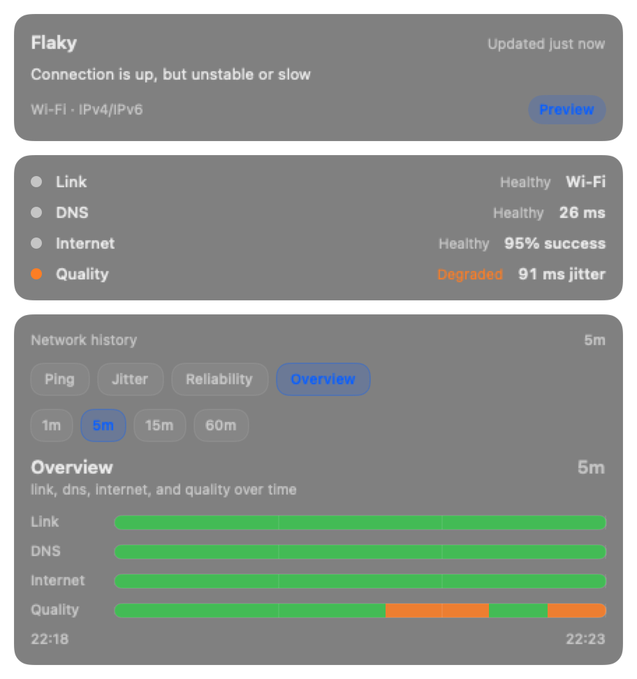

# SignalBar

SignalBar is a macOS menu bar app that continuously answers:

> Is the network actually bad right now — and if so, which part is failing?

It focuses on **diagnosis by layer**, not a generic score:

1. **Link**
2. **DNS**
3. **Internet**
4. **Quality**

If your core path is healthy but a watched service is not, SignalBar keeps the core bars healthy and surfaces that as a **service-specific issue** instead of lying about the entire internet being broken.

> [!WARNING]
> SignalBar is still an early public prototype. The core architecture and test coverage are solid, but packaging, broader settings UX, and persistent history are still evolving.

<p align="center">
  
</p>

## Why SignalBar exists

A lot of network tools tell you that something is “slow” without telling you **where** the problem actually is.

SignalBar is designed for moments like:
- SSH or Zoom feels laggy
- a page refuses to load
- Wi‑Fi looks connected but everything feels weird
- one work service is down while the broader internet is fine

The goal is to make the menu bar answer three questions at a glance:
1. is the problem real?
2. is it local or upstream?
3. which layer is failing first?

## Current capabilities

SignalBar currently includes:
- a runnable macOS menu bar app
- live `NWPathMonitor` link monitoring
- live DNS probes against default control targets
- live HTTPS probes against default control targets
- derived quality signals from latency, jitter, and reliability
- rolling in-memory history graphs
- two toolbar display modes
- two toolbar color modes
- launch at login from `Settings… -> General`
- a dedicated settings window for display, watched-target, and app-level preferences
- focused tests for diagnosis, aggregation, history, store behavior, and UI mapping

## How to build and run

### Requirements
- macOS 14+
- Xcode 16.1+ or a compatible Swift 6.1+ toolchain

### Validate the repository
```bash
swift build
swift test
./scripts/lint.sh
```

### Run the menu bar app
```bash
./run-menubar.sh
```

### Stop the app
```bash
./stop-menubar.sh
```

## Build and publish releases

SignalBar includes source-first packaging, signing, notarization, and GitHub release scripts.

Create and verify a local signed release:
```bash
./scripts/release_local.sh
```

Create a notarized public release locally:
```bash
./scripts/release_public.sh
```

Create and publish a notarized GitHub release from your local Mac:
```bash
./scripts/release_github_local.sh
```

This produces release artifacts under `dist/` and can upload the final notarized zip to GitHub Releases. See [docs/releasing.md](docs/releasing.md) for details.

## Repository guide

- [Getting started](docs/getting-started.md)
- [Development](docs/development.md)
- [Architecture](docs/architecture.md)
- [Privacy](docs/privacy.md)
- [Project status](docs/status.md)
- [Releasing](docs/releasing.md)

## Privacy posture

SignalBar is designed to stay lightweight and local-first:
- no telemetry
- no packet capture
- no privileged monitoring
- no invasive permissions
- watched-target probing is opt-in
- current history is in-memory only

See [docs/privacy.md](docs/privacy.md) for the exact behavior and current limitations.

## Roadmap themes

Near-term work includes:
- richer target configuration UX and additional settings beyond the first dedicated settings window
- stronger packaging/distribution ergonomics
- persistent history storage
- continued diagnosis and scheduler refinement

See [docs/status.md](docs/status.md) for the public project status.

## License

MIT — see [LICENSE](LICENSE).
